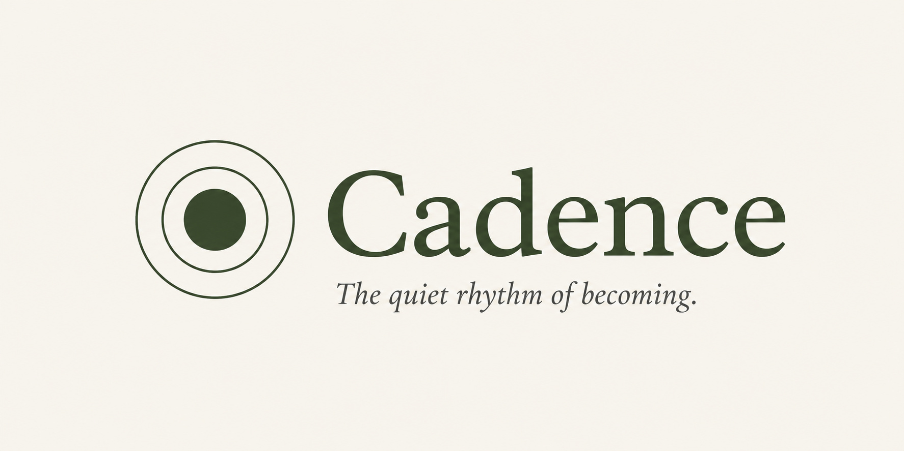
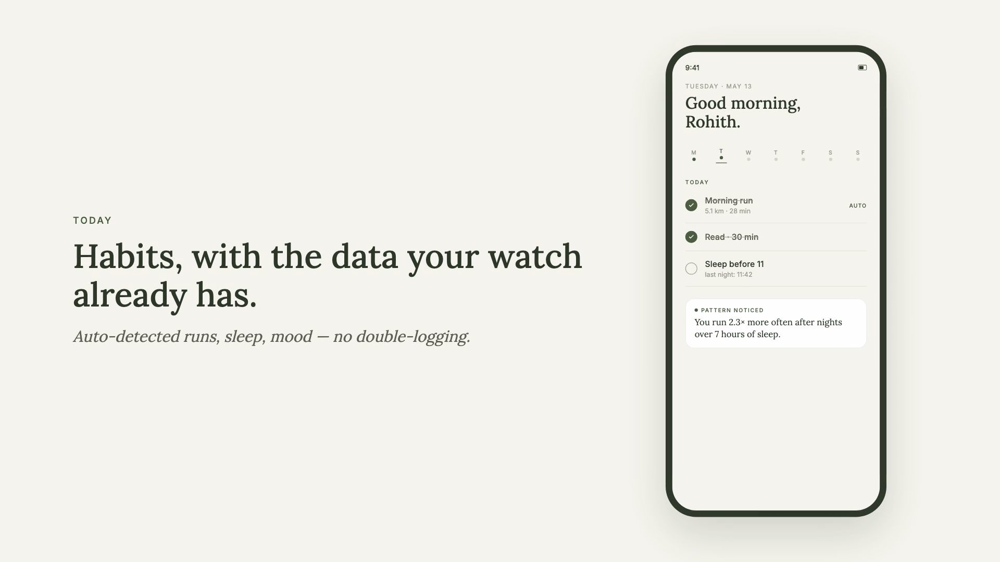
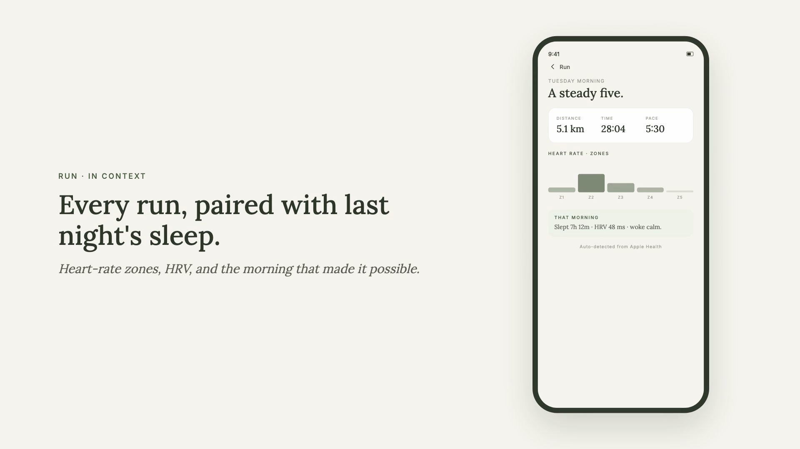
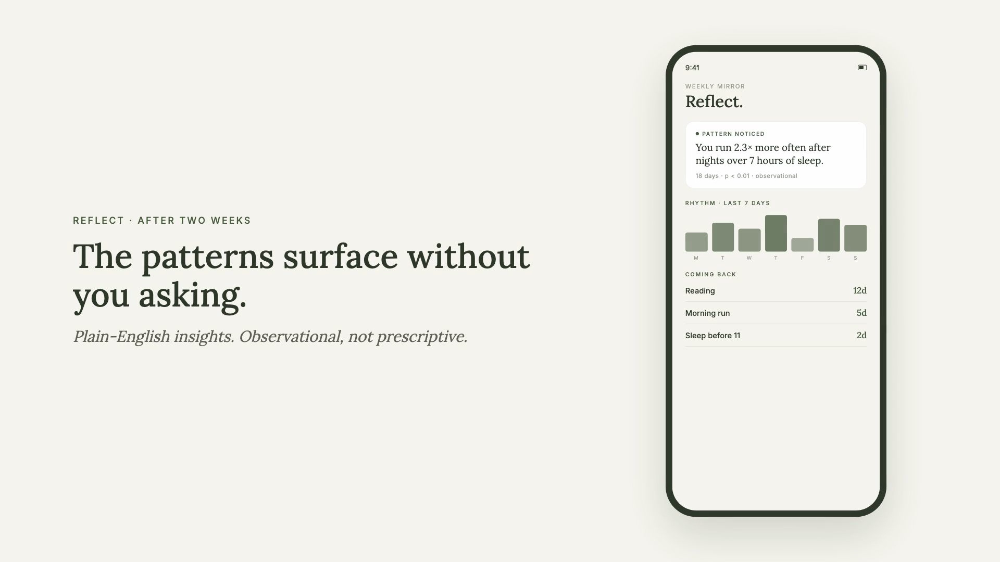
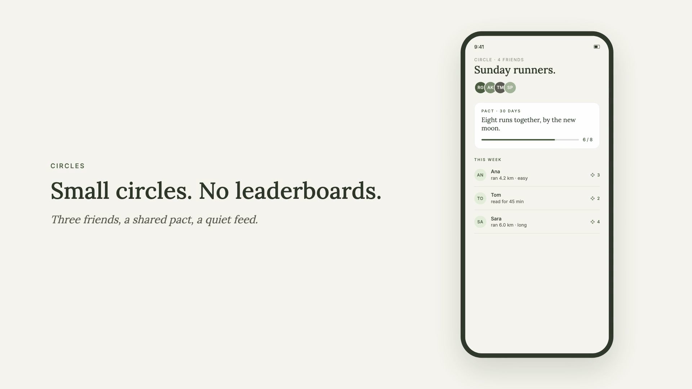

<p align="center">
  
</p>

<h1 align="center">Cadence</h1>

<p align="center">
  <em>A quiet habit tracker for runners and the quietly committed.</em>
</p>

<p align="center">
  <a href="https://cadence.gilla.fun">cadence.gilla.fun</a> ·
  <a href="https://cadence.gilla.fun/privacy">Privacy</a> ·
  <a href="https://cadence.gilla.fun/terms">Terms</a>
</p>

<p align="center">
  
  
  
</p>

---

Cadence pairs what you do with how you slept, your HRV, and your runs — and after about two weeks, tells you which lever actually moves your rhythm.

The wedge in one sentence:

> **You run 2.3× more often after nights over 7 hours of sleep.**

That's the kind of thing the app surfaces. Observational, not prescriptive. Surfaced only when the correlation passes a sample-size, p-value, and effect-size bar. Until then, Cadence stays quiet.

## What it looks like

<table>
  <tr>
    <td width="50%"></td>
    <td width="50%"></td>
  </tr>
  <tr>
    <td width="50%"></td>
    <td width="50%"></td>
  </tr>
</table>

The full pitch videos live in [`videos/out/`](videos/out/) — `cadence-twitter.mp4` (16:9) and `cadence-story.mp4` (9:16).

## What's in the box

- **Habits that respect quiet days.** Streaks survive coming back. Tag why you missed if you want; leave it blank if you don't.
- **Apple Health, on by default.** HRV, sleep stages, resting heart rate, workouts, GPS routes. Raw samples never leave your phone — only daily rollups do.
- **Running mode.** Weekly mileage, run map, per-run HR zones, every run paired with last night's sleep + HRV.
- **Circles.** Two or three friends, a shared weekly pact, a flower reaction. No leaderboards. No public feed.
- **Insight engine.** Surfaces patterns only when the data is strong enough to bet on. Deterministic templates, not LLM hallucinations.

## What it doesn't do

No XP. No badges. No streak shame. No fire emojis. No leaderboards. No data sales. No AI coach pretending to know you. No gamification, gym logging, or calorie tracking — those are explicit non-goals.

## Try the beta

iOS only at the moment. The TestFlight public link is published on [cadence.gilla.fun](https://cadence.gilla.fun) once Beta Review clears.

Android is "nearly free" from the Expo build — but won't be opened until after the iOS beta cycle.

## Repo layout

```
cadence/
├── cadence-mobile/   Expo + React Native + TypeScript app
├── cadence-api/      Go API + Postgres + cron worker
├── landing/          The static site at cadence.gilla.fun
├── videos/           Remotion source for the pitch videos
├── docs/             Design system, asset spec, brand files
└── CLAUDE.md         Conventions for working in this repo
```

See the per-app READMEs for local dev:

- [`cadence-mobile/README.md`](cadence-mobile/README.md) — Expo dev server, EAS build, simulator setup
- [`cadence-api/README.md`](cadence-api/README.md) — Go server, migrations, Docker compose

## Tech stack

| Layer | What's used |
|---|---|
| Mobile | Expo SDK 54, React Native, TypeScript, Expo Router, TanStack Query, Drizzle for local cache |
| Auth | Firebase Authentication (Apple + Google) |
| API | Go 1.23, `chi` router, `pgx`, golang-migrate |
| DB | Postgres 17 |
| Health | Apple HealthKit (on-device summaries), Strava (server-side) |
| Push | Expo Push Service → APNs |
| Insights | Server-side cron worker, deterministic templates, Pearson + effect-size thresholds |
| Hosting | Oracle Ampere ARM64 VPS, Cloudflare Tunnel, Portainer-managed compose stack |
| Brand | Lora (web) / Iowan Old Style (iOS), Tabler icons, hand-tuned moss + ink palette |

## Design language

The visual system lives in [`docs/DESIGN_SYSTEM.md`](docs/DESIGN_SYSTEM.md) — tokens, components, voice. Brand assets live in [`docs/brand/`](docs/brand/) and [`docs/ASSETS.md`](docs/ASSETS.md).

A few non-negotiables:

- **No red.** Warnings are sand. "Over-zone" is clay.
- **No shadows for importance.** Hairline borders and spacing do the work.
- **Iowan Old Style on iOS, Lora on web.** System sans for everything else.
- **One icon library.** Tabler.

## Status

This is a 20-week solo build, currently around Phase 6 of the PRD: TestFlight beta, push notifications, delete-account, legal pages, landing site. The PRD itself is private; ask if you'd like to see a section.

## Contributing

It's early. If you want to suggest a fix, open an issue or a small PR — I'll happily look at it. Bigger changes are best discussed first so we don't both put in work that doesn't ship.

## Licence

[MIT](LICENSE) for the source. The Cadence name and brand mark are not covered by the licence — fork it under a different name and mark, please.

## Contact

[support@cadence.gilla.fun](mailto:support@cadence.gilla.fun)

· · ·

<p align="center"><sub>The quiet rhythm of becoming.</sub></p>
